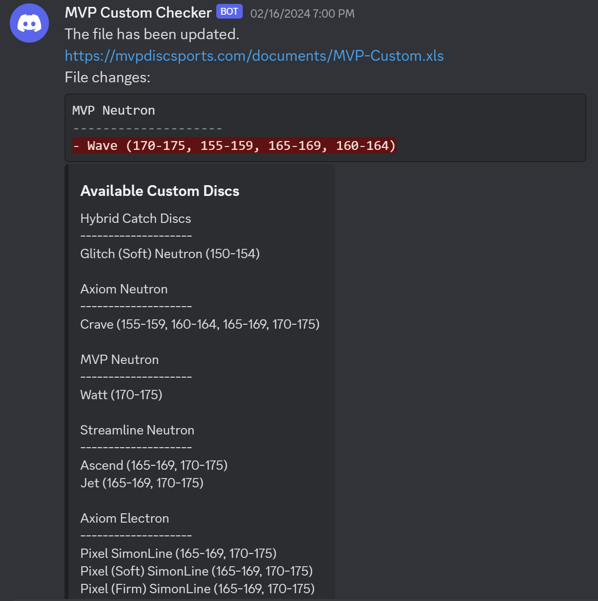

This is going to be a multi-part post that will explain a project that I have created to build an ecosystem around a Discord bot.

# What is a Discord? And why does it need a Bot?

Discord is a chatting ecosystem.  Typically geared toward gamers, it is simply a place where people can chat in individual servers (or guilds) with people that share the interest that that Discord server was built around.  There are thousands, if not millions, of Discord servers that exist, ranging from support servers for small code libraries, up to massive AI help systems, to LFG (looking for group) servers for your favorite games.  If you could think of something, there is likely a Discord server based around that.

So why do these servers need a bot and for that matter what is a bot?  So in the most basic sense, a Discord bot is simply a program that is added to a server to help enhance the server.  Let's think about a massive AI bot that most people know about these days, Midjourney.  Midjourney itself is an AI image generation system that takes in prompts like "Make me a picture of the moon, but make it look like a piece of cheese that a mouse is eating", and it will produce it's best image around what it thinks you want.  Imagine being able to take that technology, and add it to your Discord server that was setup for your Final Fantasy XIV guild.  You would go find the Midjourney Discord Bot, and add it to your server to allow all those in your server to use that bot.

So, if you wanted to make a program that people could use in their Discord servers, you would run that program either locally or on a cloud server, and connect it to a bot token, and then pass out the URL that people can use to install that bot on their server.

# What kind of Bot are you creating?

Great question rhetorical question asker.  For anyone that knows me, I love the sport of Disc Golf.  If anyone doesn't know what that is, just imagine something similar to golf, with frisbees.  Well I have started a business a few years ago around making custom Christian stamped discs.  These discs have a Christian theme around them, and they are printed onto discs by the manufacturer of the discs.  Well in order for me to know what discs are available to print on, some companies will send me Excel spreadsheets giving me the molds that are available when I ask.  While that is fine, it requires me to inquire to them to figure out what discs are ready when I am ready to order.  But what if I want to know what discs are available now from certain companies without needing to ask them.  So there is a single company (that I know of) that has a download link for their available custom disc selection.  MVP Disc Sports is the leading edge in technology and innovation of all areas of disc golf, and in this effort, they have offered up a download link on their website that allows me to download their available custom molds sheet whenever I want, however they don't announce when the sheet gets updated.

So my goal with this Discord Bot is to download this file periodically (every 2 to 3 hours) and check the file to see if there are any changes in it.  While this seems simple on the surface, I want to be able to announce to any Discord server when this update happens, and be able to look at previous files that have been uploaded.  So here is the plan for this project:

- Create a console application that pulls down the spreadsheet periodically, and check if it has been updated since the last time that we put out a change announcement.
- Create a publically accessible api that allows for people to create a webhook around this system and receive announcements when the file has changed
- Create an actual Discord Bot that allows servers to query the system on the latest available molds, even if they don't want to add the webhook system into their server
- Create a web page that we can manage several things about the bot and file storage.

This may seem like a tall task, but I have already made a large portion of the application created as a proof-of-concept to show that you don't even need a cloud server or local server to run your application on.  I will make a seperate post on that sometime later.

Here is a picture of the way the Discord bot currently outputs the custom files:

# Plan for this series of posts

So my plan for these posts is to make several individual posts that cover each of these parts.  All the code will be encompassed in GitHub and I will add the link to the repository at the end of each of these posts.

- [ ] Console Application to pull the spreadsheet
- [ ] API Application to allow webhook setup
- [ ] Discord Bot Application for quick checks
- [ ] Web Page Application for managing the bot

I will go back and add links to these tasks above as I complete them and write the posts for them.